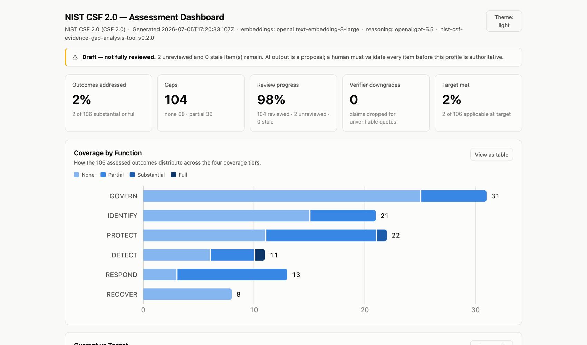
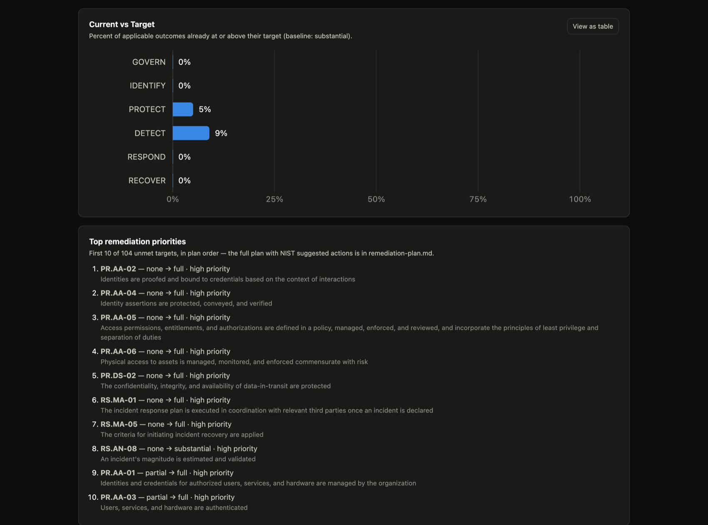
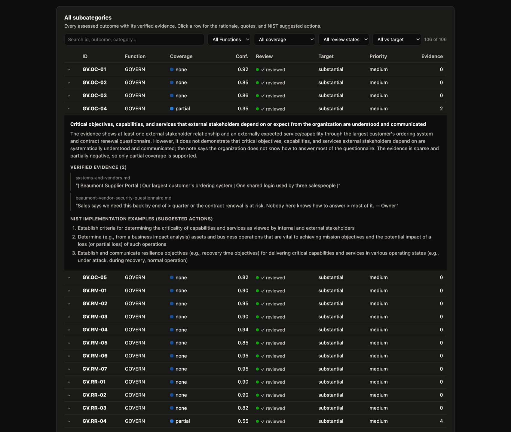

# NIST CSF 2.0 — AI-Assisted Evidence & Gap Analysis Tool

A free, open-source tool that helps any organization measure how well its
existing security practices meet the United States' national cybersecurity
standard — the NIST Cybersecurity Framework (CSF) 2.0 — and shows exactly where
the gaps are.

<p align="center">
  <picture>
    <source media="(prefers-color-scheme: dark)" srcset="docs/images/dashboard-dark.png">
    
  </picture>
</p>
<p align="center"><em>One of the deliverables: <code>dashboard.html</code> — a single self-contained file (no server, no network) with the whole assessment: coverage, review status, current-vs-target, and every outcome's verified evidence.</em></p>

## Purpose and significance

Cybersecurity is a recognized national priority in the United States: attacks on
businesses, hospitals, schools, utilities, and local governments cause serious
economic and public harm. To help organizations manage this risk, the U.S.
government's National Institute of Standards and Technology (NIST) publishes the
Cybersecurity Framework (CSF) 2.0 — a common, widely used national standard that
defines 106 cybersecurity outcomes an organization should achieve. (An "outcome"
is a concrete result the organization should be able to demonstrate — for
example, keeping an up-to-date inventory of its hardware.)

In practice, the evidence of how an organization actually protects itself is
spread across dozens or hundreds of documents — security policies, procedures,
audit reports, standards, and internal records, often scattered across different
teams and systems. Reading through all of that by hand and matching each piece
of evidence to the right outcome in the NIST framework is laborious, slow, and
error-prone, even for trained specialists. This is the main practical obstacle to
adopting the standard.

This project addresses that obstacle. It automatically reviews an organization's
own documents against all 106 outcomes defined by NIST CSF 2.0, locates the
supporting evidence and the gaps, and produces a clear report — accelerating work
that is laborious even for experienced security specialists. Because it is free,
open to everyone, and can run entirely on the user's own computer, sensitive
documents never have to leave the premises. This makes it practical for any
organization to produce a rigorous, evidence-based picture of where it stands
today against the standard — what the framework calls a "Current Profile" — and
makes the work faster and more consistent for the specialists who perform it.
Broader, more consistent adoption of a common cybersecurity baseline strengthens
the resilience of the wider economy and of critical public services.

To keep its results trustworthy, the tool never lets the AI have the final word:
every finding must be supported by an exact quote from the organization's own
documents, and a person reviews and confirms each one.

## Contents

- [Purpose and significance](#purpose-and-significance)
- [What it does](#what-it-does)
- [How it works](#how-it-works)
- [Install](#install)
- [Quick start (offline, no API key)](#quick-start-offline-no-api-key)
- [Usage](#usage)
- [Providers, privacy, and offline mode](#providers-privacy-and-offline-mode)
- [Outputs](#outputs)
- [How this supports CSF 2.0](#how-this-supports-csf-20)
- [Anti-hallucination safeguards](#anti-hallucination-safeguards)
- [Configuration](#configuration)
- [Data source (CPRT)](#data-source-cprt)
- [Limitations](#limitations)
- [Project documentation](#project-documentation)
- [License](#license)

## What it does

Point the tool at a folder of your documents (security policies, SOC 2 reports,
ISO 27001 documentation, internal procedures). It then:

1. **Ingests** the documents — parses them, splits them into overlapping chunks,
   computes embeddings, and stores everything in a local on-disk index.
2. **Analyzes** coverage — for **every** one of the 106 CSF 2.0 Subcategories it
   retrieves the most relevant document chunks and asks an AI engine whether that
   evidence shows the outcome is actually achieved.
3. **Review** — a human-in-the-loop step where you accept, override, or annotate
   each AI judgment alongside its supporting evidence.
4. **Target** (optional) — you declare a Target Profile: the goal coverage for
   every outcome (with per-Function/Category/Subcategory overrides), remediation
   priorities, and outcomes that are out of scope. Targets are human decisions;
   no AI is involved.
5. **Reports** — turns the reviewed assessments into a Current Profile (JSON), a
   gap-analysis report (Markdown), an evidence map (CSV), and a self-contained
   HTML dashboard — plus, when a target exists, a Target Profile (JSON) and a
   **prioritized remediation plan** whose suggested actions are NIST's own CSF
   2.0 Implementation Examples, quoted verbatim.

At any point, the read-only **`status`** command summarizes the saved state of
those stages, identifies stale reviews or reports, and tells you the next command
to run.

For a full step-by-step walkthrough, see the **[Usage Guide](docs/GUIDE.md)**.

## How it works

### "Inverted RAG"

Instead of a user asking questions, the tool iterates over all Subcategories and,
for each one, retrieves the top-k closest document chunks and asks the AI to
evaluate coverage **against that retrieved evidence only**. Embeddings are
L2-normalized so cosine similarity is a plain dot product, and retrieval is an
exact in-memory scan — the corpus is one organization's documents, so no external
database or vector service is needed.

### Outcomes, not topics

CSF 2.0 Subcategories are *outcomes*, not controls or topics. The tool judges
whether the evidence shows an outcome is actually achieved — not merely that the
subject is mentioned. A policy that says something "must" happen is treated as
weaker evidence than records showing it actually happens.

## Install

Requires **Node.js >= 20.10**.

```bash
git clone https://github.com/MarianoFacundoArch/nist-csf-evidence-gap-analysis-tool.git
cd nist-csf-evidence-gap-analysis-tool
npm install
```

`npm install` pulls two small required dependencies (`ajv` for schema validation,
`@clack/prompts` for the interactive menu). The heavier provider/parser
dependencies (`openai`, `@huggingface/transformers`, `mammoth`, `pdfjs-dist`) are
declared as **optional** and are loaded only when the corresponding provider or
file type is actually used.

To use the command globally as `csf-tool`, run `npm link`. The examples below use
`node bin/csf-tool.js`.

## Quick start (offline, no API key)

Run the whole pipeline against the bundled sample documents using a deterministic
**mock** engine — no network and no API key:

```bash
node bin/csf-tool.js all \
  --docs examples/sample-docs \
  --embed-provider mock --llm-provider mock \
  --work-dir ./output --accept-all
```

Then open `./output/reports/gap-analysis.md` — and `./output/reports/dashboard.html`
in a browser for the interactive view. A committed reference copy lives in
`examples/worked-example/`, regenerable byte-for-byte with `npm run example`.

(`--accept-all` auto-accepts every AI proposal so the demo runs unattended; a
real assessment uses the human review step instead — see [Usage](#usage).)

## Usage

There are two ways to drive the tool, and they share the **same** underlying code.

**Interactive menu** (run with no command — it walks you through each step):

```bash
node bin/csf-tool.js
```

**Command mode:**

```bash
node bin/csf-tool.js init       # scaffold a config file, .env, and working dir
node bin/csf-tool.js ingest     # parse + chunk + embed + index your documents
node bin/csf-tool.js analyze    # AI coverage judgments for all 106 Subcategories
node bin/csf-tool.js review     # human-in-the-loop validation
node bin/csf-tool.js target     # define the Target Profile (goals + priorities)
node bin/csf-tool.js report     # generate the deliverables
node bin/csf-tool.js status     # inspect saved progress, freshness, and next step
node bin/csf-tool.js all        # run the whole pipeline end-to-end
```

The `target` stage is interactive in a terminal; for scripted runs use
`--target-default <level>` (set the baseline goal) or `--target-import <path>`
(bring your own spec, e.g. one derived from a NIST Community Profile), or edit
`<work-dir>/target.json` by hand — it is plain, validated JSON.

Run `status` whenever you want a compact checkpoint without changing any
assessment data:

```bash
node bin/csf-tool.js status
```

The equivalent package-script form is `npm run status -- --work-dir <path>`.
It reports the state of ingest, analysis, review, target, and report generation;
distinguishes current reviews from reviews made stale by a changed assessment;
flags reports that predate newer ingest, analysis, review, or target activity
(or whose saved input snapshot or deliverable set no longer matches); validates
the hand-editable target; and ends with an actionable `Next: <command>`
recommendation. The same view is available from the interactive menu.
After upgrading a work directory created before v0.2.1, run the recommended
`report` command once to seed its exact input snapshot; subsequent hand edits
are then detected even when their timestamps are unchanged.

Each stage persists its output, so you can stop after any stage and resume later.
`analyze` is resumable — already-assessed items are skipped unless their inputs
changed (or you pass `--force`). Long-running stages also report useful progress:
ingest shows file position and percentage, analysis reports every ten outcomes
(including cache hits) with elapsed time and an approximate ETA, and review shows its queue
position. Run `--help` for all flags, and see the **[Usage
Guide](docs/GUIDE.md)** for a detailed walkthrough.

## Providers, privacy, and offline mode

The tool is pluggable. Nothing is hardcoded; you choose where embeddings and
reasoning happen.

- **Embeddings:** `local-transformers` (on-device — documents never leave your
  machine), `openai` (cloud), or `mock` (deterministic, tests).
- **Reasoning LLM:** `openai` (cloud), `ollama` (a fully-local model on your own
  machine), or `mock`.

The default is cloud-first (set `OPENAI_API_KEY` in `.env`). Pass **`--local`** for
a fully offline run (on-device embeddings + a local Ollama model); no document or
prompt ever leaves the machine. The offline path requires [Ollama](https://ollama.com):
install it, start it with `ollama serve`, and pull a model first (e.g.
`ollama pull llama3.2`). Model names are configurable; if you leave a model unset,
each provider resolves a sensible default of its own, and the OpenAI provider
adapts automatically across model generations (e.g. the GPT-5 family's parameter
conventions).

## Outputs

Written to `<work-dir>/reports/`:

- **`current-profile.json`** — a machine-readable Current Profile aligned with the
  CSF 2.0 Organizational Profile concept: one entry per Subcategory with coverage
  (`none` / `partial` / `substantial` / `full`), confidence, evidence quotes, the
  AI vs. human values, review status, and the activity timestamps captured for
  the assessment.
- **`gap-analysis.md`** — a human-readable report grouped by Function, with a
  coverage summary and **gaps listed first** (plus a Current-vs-Target section
  when a target profile exists).
- **`evidence-map.csv`** — links each Subcategory to its source files and verbatim
  quotes (RFC-4180 quoting, with spreadsheet formula-injection protection).
- **`dashboard.html`** — a self-contained interactive dashboard (open it with a
  double click; works offline — no CDN, fonts, or network of any kind). Coverage
  charts, review status, and a filterable explorer of all 106 outcomes with
  their verified quotes; an assessment-activity snapshot with human-readable
  dates; quick filters for gaps, pending reviews, unmet targets, and everything
  needing attention; visible human-override indicators; broader search across
  rationale, notes, evidence, and suggested actions; light and dark themes;
  every chart has a table view. Because it is a generated offline file, its
  activity view is a snapshot as of report generation — run `report` again
  after newer work.

When a target profile exists, two more deliverables complete the CSF 2.0
Organizational Profile pair:

- **`target-profile.json`** — the machine-readable Target Profile: current vs
  target coverage, gap size, priority, and scoping per Subcategory.
- **`remediation-plan.md`** — the prioritized action plan connecting the two
  profiles: unmet targets ranked by your priorities and distance from the goal,
  each with NIST's official Implementation Examples as suggested actions
  (verbatim, public domain — the tool never invents recommendations).

<p align="center">
  
</p>
<p align="center"><em>Current vs Target and the ranked remediation queue — priorities and targets are yours; the ordering is deterministic.</em></p>

<p align="center">
  
</p>
<p align="center"><em>Every outcome, drill-down included: the AI's rationale, the quotes verified verbatim against your documents, and NIST's own suggested actions.</em></p>

Example excerpt from a gap-analysis report:

```
## Coverage by Function

| Function | Total | None | Partial | Substantial | Full | % addressed |
| --- | ---: | ---: | ---: | ---: | ---: | ---: |
| GOVERN | 31 | 16 | 15 | 0 | 0 | 0% |
| IDENTIFY | 21 | 13 | 7 | 1 | 0 | 5% |
...

## Gaps and partial coverage (address these first)

### IDENTIFY
- **ID.RA-01** — _none_
  - Outcome: Vulnerabilities in assets are identified, validated, and recorded
  - Rationale: The evidence shows asset inventory and access reviews, but does
    not demonstrate that vulnerabilities are identified, validated, and recorded.
```

## How this supports CSF 2.0

- **Comprehensive across the Framework Core.** It assesses the complete CSF 2.0
  Core — all 6 Functions, 22 Categories, and 106 Subcategories — and produces a
  Current Profile, the artifact CSF 2.0 recommends for understanding current
  cybersecurity posture.
- **The full Organizational Profile cycle.** CSF 2.0 frames an Organizational
  Profile as a Current Profile *and* a Target Profile, compared to produce an
  action plan. The tool covers the whole loop: assess → review → set targets →
  prioritized remediation plan, with the plan's suggested actions drawn verbatim
  from NIST's own CSF 2.0 Implementation Examples.
- **Accurate by construction.** The Subcategory text and Implementation Examples
  are taken verbatim from the official NIST CPRT export (reproducible with
  `npm run build-csf-core`), every AI coverage claim must be backed by a quote
  that is verified verbatim against the source evidence in code, and nothing is
  final until a human validates it.
- **Free and reusable.** MIT licensed; runs fully offline if desired; no account,
  subscription, or paid service is required to use it.

## Anti-hallucination safeguards

The AI is constrained both by its prompt and, more importantly, by code:

- **Evidence-bound prompting.** The model may use only the evidence passed to it,
  must never assume an unseen control, and treats absence of evidence as `none`.
- **Quote or it doesn't count.** Any coverage above `none` must include at least
  one quote copied verbatim from the evidence.
- **Verbatim verification (in code).** After the model responds, the tool checks
  that each quote actually exists as a substring of the retrieved evidence
  (whitespace/case-normalized) and is substantive. If a coverage claim above
  `none` has no verifiable quote, it is **downgraded to `none`** and flagged. This
  is the authoritative check — the model's quoting is never trusted on faith.
- **Confidence threshold** flags low-confidence judgments for review.
- **Schema validation + graceful fallback.** Model output is validated; on invalid
  output the tool retries once, then falls back to `none` + needs-review — it
  never crashes.
- **Mandatory human review.** Unreviewed/stale items are clearly marked in every
  deliverable, and a **strict mode** refuses to emit the final profile until every
  item has been reviewed.

## Configuration

Precedence (low → high): built-in defaults < `csf-tool.config.json` < CLI flags.
Secrets/endpoints come from `.env` only. Run `csf-tool init` to scaffold a config.
See the [Usage Guide](docs/GUIDE.md#12-configuration-reference) for the full
reference. Key fields: `csfCorePath`, `docsPath`, `workDir`, `chunk.size`/`overlap`,
`embeddings.provider`/`model`, `llm.provider`/`model`, `llm.reasoningEffort`,
`retrieval.topK`, `analysis.confidenceThreshold`, `analysis.critique`,
`analysis.strict`, `review.showAll`.

`llm.reasoningEffort` (`low` | `medium` | `high`, default `low`) is a hint for
reasoning models that accept one and is ignored by models that do not. The
default is `low` because the measured sweep in
[`eval/RESULTS.md`](eval/RESULTS.md#4-reasoning-effort-sweep-gpt-55) found no
faithfulness gain from `medium` or `high` on this task, at roughly twice the
latency.

## Data source (CPRT)

`data/csf-core.json` contains the complete CSF 2.0 Core — all 106 Subcategory
outcomes across 6 Functions and 22 Categories, each with its official NIST
Implementation Examples (the remediation plan's suggested actions) — generated
from the official NIST Cybersecurity and Privacy Reference Tool (CPRT) export.
The CSF 2.0 Core text and Implementation Examples are in the public domain.
Regenerate it from source (requires network and `unzip`):

```bash
npm run build-csf-core
```

To use your own export, point `csfCorePath` at a JSON file with the same shape
(see the [Usage Guide](docs/GUIDE.md#11-use-the-full-framework--your-own-csf-export)).

## Limitations

- **No OCR (v1).** PDFs are supported only when they contain a real text layer.
  Scanned/image-only PDFs are detected and skipped with a warning.
- **The AI is advisory.** Its output is a proposal; the human review step is
  mandatory. Do not treat an unreviewed profile as authoritative.
- **The `mock` provider is not a real model.** It is deterministic and exists only
  for tests and the reproducible worked example.
- **Model capability matters.** Very small local models tend to be over-conservative
  and return mostly `none`/`partial`; use a larger local model or a current cloud
  model for well-calibrated coverage. Human review is where coverage is confirmed.
- **Embedding-model consistency.** If you change the embedding model, re-run
  `ingest` — vectors from different models cannot be mixed.

## Project documentation

- [Usage Guide](docs/GUIDE.md) — detailed, explained walkthrough.
- [CONTRIBUTING](CONTRIBUTING.md) — development setup and how to contribute.
- [CHANGELOG](CHANGELOG.md) — release notes.
- [AUTHORS](AUTHORS) — maintainers and contributors.
- [NOTICE](NOTICE) — data provenance and third-party licenses.

## License

MIT — see [LICENSE](LICENSE). Free and open source.
